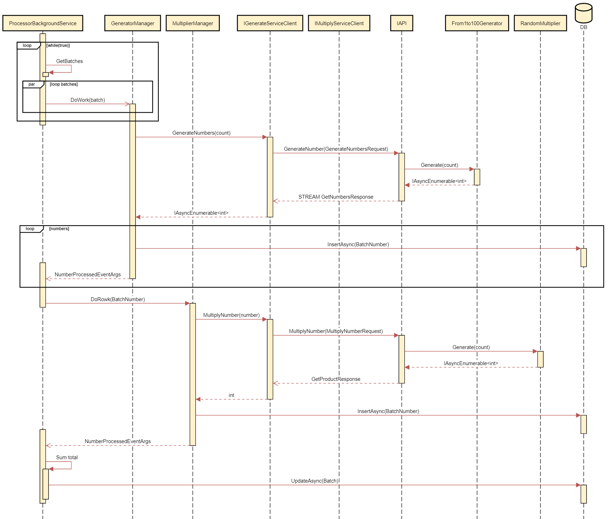

# BDTest

Table of contents
  - [Introduction](#introduction)
  - [Architecture](#architecture)
  - [Dependencies](#dependencies)
  - [Database](#database)
  - [Use Cases](#use-cases)
  - [Running](#running)

## Introduction
This is an ASP.NET Core, single-page application (using Angular 9 as a front-end) with Web API back-ends to manage the processing of numbers in batches.

## Architecture
One of the main advantages in this "gateway" pattern used is to mitigate security risks, allowing to expose resources (e.g. storage, DB) as little as possible to external communication.
Also greatly induce the creation of internal fast communication micro-services talking to each other leveraging the full potential of gRPC (currently not supported by browsers) and the external API working as a orchestrator.

## Dependencies
This project follows a N-layered approach with heavy focus in interface segregation.

- BDTest.Client
  - Base project for the custom **GrpgClientFactory** implementation
- BDTest.Core
  - Entities and protos definitions
- BDTest.Data
  - Database abstraction using generic repository pattern
- BDTest.DependencyInjection
  - Composition Root for organizing dependencies and avoiding circular dependencies
- BDTest.Domain
  - Business logic services
- BDTest.EAPI
  - External RESTful API that communicates with front-end 
- BDTest.IAPI
  - Internal gRPC API that generates and multiplies numbers
- BDTest.IAPI.Client
  - A C# client implementation of **BDTest.IAPI** to help communicating with it (SDK)
- BDTest.Web 
  - Angular 10 SPA

## Database
Only two tables were needed for this project:

**Batch**
|Primary Key|Name|Type|
|:---|:----:|---:|
|Yes|Id|bigint|
|No|Count|int|
|No|Status|int|
|No|Total|int|

**BatchNumber**

|Primary Key|Name|Type|
|:---|:----:|---:|
|Yes|Id|bigint|
|No|BatchId|bigint|
|No|Number|int|
|No|Product|int|

## Processing

## Running

The projects that needs to run are _BDTest.IAPI (https://localhost:6011)_, _BDTest.EAPI (http://localhost:5000)_ and _BDTest.Web (http://localhost:8080)_.

**Once they are done, navigate to http://localhost:8080**

---
**NOTE**

When building BDTest.Web, MSBuild will trigger `npm install` command which might take a while to finish.

---

> **Visual Studio**
> 
> Visual Studio should be already configured to start them when running.

> **Visual Studio Code**
> 
> There are individual tasks configured to start each project, as well with a **run ALL** that runs all 3 projects

